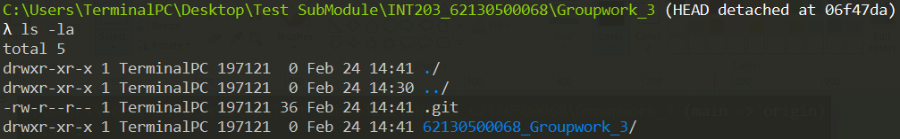

# INT203 62130500068 Backup Repository
This markdown will contain link to all of my work since work 1 to latest work.
## Link for another sub-repo
* [Work 1: Starting using Tailwind (Cloning a website)](https://github.com/Sharkthoven/INT203_62130500068/tree/main/62130500068_Groupwork_1)
* [Work 2: Starting using Vue 3 (Making your profile)](https://github.com/Sharkthoven/INT203_62130500068/tree/main/62130500068_Groupwork_2)
* [Work 3: Photo Gallery I (Showing image and like button)](https://github.com/Sharkthoven/INT203_62130500068_Groupwork_3)
* [Work 4: Photo Gallery II (Expandable image and search bar)](https://github.com/Sharkthoven/INT203_62130500068_Groupwork_4)
* [Work 5: Photo Gallery II V.2 (Using components to your work)](https://github.com/Sharkthoven/INT203_62130500068_Groupwork_5)

## Accessing a lock module
       
There are special folder (as u can see in this repo) it's call submodule, If you try to open in CLI, it seems like you can access this folder normally but no, you can't. 


To open this you need to access by cloning in special way :)
```
git clone --recurse-submodules https://github.com/Sharkthoven/INT203_62130500068.git
```
After using this commmand, GitHub will convert submodule into source code.

And there you go, now you get my source code :)

### Argh ! I forgot to follow your instruction...
No problem, you can just use this command in repo folder
```
git submodule init
```
and then using 
```
git submodule update
```
you will get something like this...


**YEAHHH!! You got my source code now :)**
